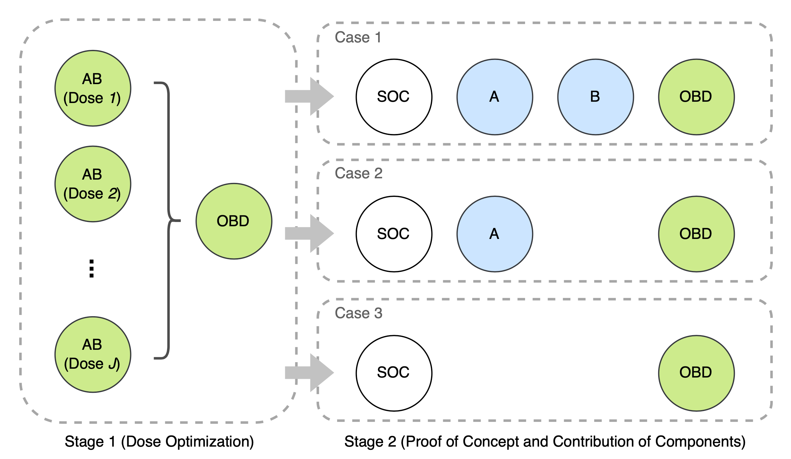

<!-- README.md is generated from README.Rmd. Please edit that file -->

```{r, include = FALSE}
library(tibble)
knitr::opts_chunk$set(
  collapse = TRUE,
  comment = "#>",
  fig.path = "man/figures/README-",
  out.width = "100%"
)
```

# COCA: Combination Dose Optimization and Component Contribution Assessment

<!-- badges: start -->

<!-- badges: end -->

### Overview

**COCA** is a two-stage randomized phase II design that seamlessly integrates combination dose optimization with component contribution assessment. In stage 1, the optimal combination dose is determined by maximizing the risk–benefit tradeoff across multiple candidate combination doses. In stage 2, a multi-arm randomized phase is initiated to evaluate the contribution of each component within the combination therapy.



### Installation

To install the COCA package from GitHub, run:

``` r
if (!require("devtools")) {
  install.packages("devtools")
}
devtools::install_github("xiaohanchi/COCA")
```

### Usage

Load COCA package:

```{r load, eval = FALSE}
library(COCA)
```

For a specific stage 2 sample size (e.g., 20), get the calibrated design cutoffs and power:

```{r example1, eval = FALSE}
COCA.calibration(
  case = 1, n.stage1 = 24, n.stage2 = 20, 
  dosage.ctrl = c(A = 0, B = 0), dosage.singleA = 300, dosage.singleB = 300, 
  dosage.comb = list(A = c(300, 300, 200), B = c(300, 200, 300)),
  eff.null = 0.25, eff.alt.SOC = 0.25, eff.alt.A = 0.35, 
  eff.alt.B = 0.35, eff.alt.AB = 0.55, period.effect = c(0.1, 0.2, 0.3), 
  alpha.level = 0.10, alpha.max = 0.20, fsr.level = 0.05, tsr.level = 0.80, n.simu = 100
)
```

-   `n.simu` is set to 100 for illustration. For more accurate calibration, consider using a larger value, such as 10000, though this may require additional computation time.
-   If the power does not reach the target, increase `n.stage2` and repeat the process.

Once the optimal `n.stage2` is found, run simulations to get the operating characteristics of the COCA design with the calibrated configurations:

```{r example2, eval = FALSE}
# E.g., scenario 1 (period effect = 0)
COCA.getOC(
  case = 1, n.stage1 = 24, n.stage2 = 26, Ce = 0.8983, c0 = 0.7, 
  dosage.ctrl = c(A = 0, B = 0), dosage.singleA = 300, dosage.singleB = 300,
  dosage.comb = list(A = c(300, 300, 200), B = c(300, 200, 300)),
  tox.SOC = 0.10, eff.SOC = 0.25, tox.A = 0.25, tox.B = 0.15, 
  eff.A = 0.25, eff.B = 0.25, tox.AB = c(0.30, 0.30, 0.15), 
  eff.AB.s1 = c(0.25, 0.25, 0.25), eff.AB.s2 = c(0.25, 0.25, 0.25), 
  tox.isomat = matrix(c(2, 1, 3, 1), byrow = TRUE, nrow = 2),
  tox.upper = 0.35, eff.lower = 0.25, Cs = 0.85, C.f1 = 0.9, C.f2 = 0.9,
  utility.score = c(0, 60, 40, 100), rho = 0.2, n.simu = 20
)
```

-   Again, `n.simu` is set to 100 for illustration. For more accurate simulation, consider using a larger value, such as 10000.

##### \* Competing Approaches

We provide R code to implement the competing approaches (MTD-Ind, OBD-Ind, and OBD-Pool) mentioned in the paper<sup>[1]</sup>. To access it, use the following R code:

``` r
open_example("alt_designs.R")
```

Detailed instructions for reproducing the results in paper [1] are provided at the end of the script, along with some example output `.Rdata` files in `inst/example_Rdata`.

### Examples: Redesigning the NCT02519348 Trial

This example provides a step-by-step tutorial on redesigning the NCT02519348 trial<sup>[2]</sup> using COCA. This trial involves four arms: T 300 mg $\times$ 1 dose plus D 1500 mg (T300+D), T 75 mg $\times$ 4 doses plus D 1500 mg (T75+D), D 1500 mg monotherapy, and T 750mg monotherapy.

##### 1. Preparation

To get started, we need to specify the appropriate input arguments. Since this trial lacks a control arm, we assume the T monotherapy arm as the standard of care (SOC) control for illustration. Therefore, this trial falls into `case = 2` (S0C(A) vs. B vs AB). We use the log scale dosage as the dosage input for each arm:

``` r
dosage.ctrl = c(A = log(750), B = 0)
dosage.singleA = 0 #Set to zero since single agent A is considered as the control arm
dosage.singleB = log(1500) 
dosage.comb = list(A = c(log(300), log(75)), B = c(log(1500), log(1500)))
```

The null hypothesis is $H_0: q_{21}=q_{22}=q_{23}=0.07$, so `eff.null = 0.07`. The alternative hypothesis is $H_1: q_{21}=0.07, q_{22}=0.12, q_{23}=0.25$, so:

``` r
eff.alt.SOC = 0.07
eff.alt.B = 0.12
eff.alt.AB = 0.25
```

We also hope to control the maximum type I error under potential period effects within the range of 0 to 0.1, so we specify `period.effect = seq(0, 0.1, 0.02)`. For other configurations, please refer to Section 5 of [1]. With all these arguments in place, we can proceed to calibrate our design parameters.

##### 2. Calibration

The `COCA.calibration` function will output the corresponding power and design cutoffs ($C_{e1}$ and $c_0$). If the target FSR and TSR levels are not met with the current settings, `COCA.calibration` will return $c_0=-1$ and issue a warning suggesting an increase in the stage 2 sample size. We would like to assume `n.stage1 = 24` and search for the optimal stage 2 sample size, starting from 30, until the target power (`output$Power`) and success rate (`output$c0`) are achieved:

```{r, echo = TRUE, eval = FALSE}
power.target <- 0.90
n.stage2 <- 30
search.step <- 2
output <- list(Power = 0, c0 = -1)
while(output$Power < power.target | output$c0 == -1){
  output <- COCA.calibration(
    case = 2, n.stage1 = 24, n.stage2 = n.stage2, 
    dosage.ctrl = dosage.ctrl, dosage.singleA = 0, 
    dosage.singleB = dosage.singleB,  dosage.comb = dosage.comb,
    eff.null = 0.07, eff.alt.SOC = 0.07, eff.alt.B = 0.12, eff.alt.AB = 0.25, 
    period.effect = seq(0, 0.1, 0.02), alpha.level = 0.10, alpha.max = 0.20, 
    fsr.level = 0.05, tsr.level = 0.80, n.simu = 10000
  )
  n.stage2 <- n.stage2 + search.step
}

output
```

```{r, echo = FALSE}
display.output <- tibble(
  case = 2, n.stage2 = 38, Ce1 = 0.7710, c0 = 0.84, Power = 0.9138, TypeI = 0.100
)
display.output
```

This code may take a while to run... (Note: In my own implementation, I used high-performance computing clusters and parallel computing to accelerate the process.) For illustration, consider using a smaller number of replicates (e.g., `n.simu = 100`). Once completed, we obtained the optimal stage 2 sample size of 38, along with design cutoffs $C_{e1}=0.7710$ and $c_0=0.84$, as reported in our paper.

##### 3. Run COCA Design

The `COCA.getOC` function is used to obtain the operating characteristics of stage 1 (selection and expected sample size) and stage 2 (power, GP, SR, OSR, and expected sample size) of COCA. So far, we have obtained the optimal design parameters: `n.stage2 = 38`, `Ce = 0.7710`, and `c0 = 0.84`. To assess the design performance, we still need to specify the true efficacy and toxicity rates. Using the observed trial outcomes: the toxicity rates in the four arms (T vs. D vs. T300+D vs. T75+D) were 24.6%, 10.9%, 17.6%, and 14.6%, and efficacy rates were 7.2%, 10.6%, 24.0%, and 9.5%, respectively. Therefore:

``` r
tox.SOC = 0.246
tox.B = 0.109
tox.AB = c(0.176, 0.146)

eff.SOC = 0.072
eff.B = 0.106
eff.AB.s1 = c(0.240, 0.095) # assume no period effect
eff.AB.s2 = c(0.240, 0.095)
```

We assume the toxicity ordering between the two combination doses is T300+D $\geq$ T75+D, so

``` r
tox.isomat = matrix(c(2, 1), byrow = T, nrow = 1)
```

We use a utility score of `utility.score = c(0, 40, 60, 100)` in stage 1 dose optimization. For additional configurations, please refer to Section 5 of [1].

First, let's assume no period effect between stages 1 and 2 and obtain the design operating characteristics:

```{r, echo = TRUE, eval = FALSE}
COCA.getOC(
  case = 2, n.stage1 = 24, n.stage2 = 38, Ce = 0.7710, c0 = 0.84, 
  dosage.ctrl = dosage.ctrl, dosage.singleA = 0, 
  dosage.singleB = dosage.singleB,  dosage.comb = dosage.comb,
  tox.SOC = tox.SOC, eff.SOC = eff.SOC, tox.B = tox.B, eff.B = eff.B, 
  tox.AB = tox.AB, eff.AB.s1 = eff.AB.s1, eff.AB.s2 = eff.AB.s2, 
  tox.isomat = matrix(c(2, 1), byrow = T, nrow = 1), 
  tox.upper = 0.30, eff.lower = 0.07, Cs = 0.80, C.f1 = 0.90, C.f2 = 0.90, 
  utility.score = c(0, 40, 60, 100), rho = 0.2, prior.sample = 1e5, n.simu = 5000
  )
```

```{r, echo = FALSE}
stage1_output <- c(1.56, 83.34, 15.10, 83.34, 43.78)
names(stage1_output) <- c("termination (%)", paste0("dose", 1:2, " (%)"), "selection (%)", "EN")
stage2_output <- c(77.41, 73.81, 69.16, 67.43, 104.3)
names(stage2_output) <- c("Power (%)", "GP (%)", "SR (%)", "OSR (%)", "EN")
display.output <- list(
    stage1_output = stage1_output, stage2_output = stage2_output
  )
display.output
```

In stage 1, we have an 83.34% chance of selecting the correct combination dose as the OBD, with an average sample size of 43.78 patients. In stage 2, the power of our design is 77.41%, the GP is 73.81%, the SR is 69.16%, and the OSR is 67.43%, with an average sample size of 104.30 patients. In total, the trial requires an average of 148.08 patients (43.78 in stage 1 and 104.30 in stage 2). For illustration, here we set `prior.sample = 1e5` (i.e., $10^5$ prior draws per simulation) to balance computational speed and result accuracy. This code may take approximately 10–20 minutes to run, depending on your system specifications. To reproduce the results in [1], please use `prior.sample = 1e6`, though this will require additional computation time.

If the ORRs of the combinations in stage 1 are 5% higher than the stage 2 rates (i.e., period effect = 0.05), run:

```{r, echo = TRUE, eval = FALSE}
eff.AB.s1 <- c(0.240, 0.095) + 0.05
COCA.getOC(
  case = 2, n.stage1 = 24, n.stage2 = 38, Ce = 0.7710, c0 = 0.84, 
  dosage.ctrl = dosage.ctrl, dosage.singleA = 0, 
  dosage.singleB = dosage.singleB,  dosage.comb = dosage.comb,
  tox.SOC = tox.SOC, eff.SOC = eff.SOC, tox.B = tox.B, eff.B = eff.B, 
  tox.AB = tox.AB, eff.AB.s1 = eff.AB.s1, eff.AB.s2 = eff.AB.s2, 
  tox.isomat = matrix(c(2, 1), byrow = T, nrow = 1), 
  tox.upper = 0.30, eff.lower = 0.07, Cs = 0.80, C.f1 = 0.90, C.f2 = 0.90, 
  utility.score = c(0, 40, 60, 100), rho = 0.2, prior.sample = 1e5, n.simu = 5000
  )
```

```{r, echo = FALSE}
stage1_output <- c(0.36, 81.38, 18.26, 81.38, 45.87)
names(stage1_output) <- c("termination (%)", paste0("dose", 1:2, " (%)"), "selection (%)", "EN")
stage2_output <- c(77.72, 73.12, 70.75, 68.04, 105.1)
names(stage2_output) <- c("Power (%)", "GP (%)", "SR (%)", "OSR (%)", "EN")
display.output <- list(
    stage1_output = stage1_output, stage2_output = stage2_output
  )
display.output
```

##### 4. Comparison with Dunnett’s test

This package also provides the function `dunnett.comb` to implement the Dunnett’s test approach described in Web Appendix C of [1].

### Reference

[1]. Chi, X., Lin, R.<sup>\*</sup>, Yuan, Y.<sup>\*</sup> (2025+). COCA: A Randomized Bayesian Design Integrating Dose Optimization and Component Contribution Assessment for Combination Therapies. Under Minor Revision in *Biometrics*.\
[2]. Kelley, R. K., Sangro, B., Harris, W., et al. Safety, Efficacy, and Pharmacodynamics of Tremelimumab Plus Durvalumab for Patients With Unresectable Hepatocellular Carcinoma: Randomized Expansion of a Phase I/II Study. *Journal of Clinical Oncology*. 2021;39(27):2991-3001. <doi:10.1200/JCO.20.03555>
